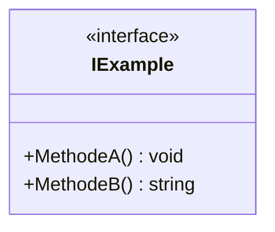
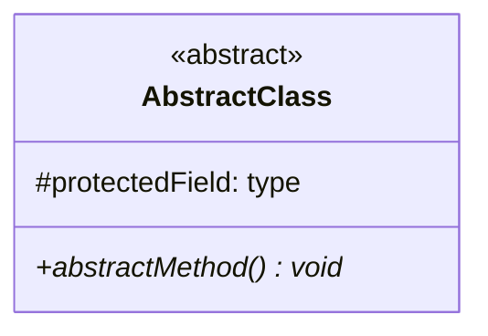
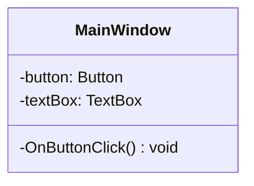
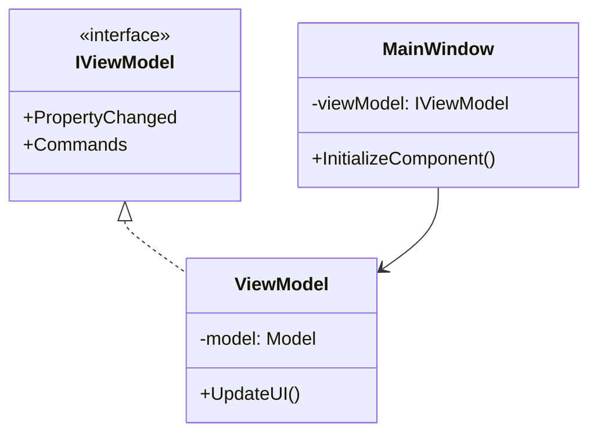

# Anleitung: UML-Diagramm Gestaltung für Interfaces und WPF

## Grundlegende UML-Notation

### Interfaces
- Interfaces werden mit `<<interface>>` über dem Interface-Namen gekennzeichnet
- Namen sollten mit "I" beginnen (z.B. `IHaustierAktionen`)
- Nur Methodensignaturen, keine Implementierungen
- Mit gestrichelten Linien und geschlossenem Pfeil verbunden (⤍)
- Syntax in Mermaid:


### Abstrakte Klassen
- Werden mit `<<abstract>>` gekennzeichnet
- Name in kursiv oder mit {abstract}
- Abstrakte Methoden mit *kursiv* oder mit {abstract}
- Verbindung zu Interfaces mit gestrichelter Linie (implements)


### WPF-Spezifische Elemente

#### UI-Elemente
- Controls als Eigenschaften mit Typ
- Event-Handler als private Methoden
- Beispiel:


## Best Practices

### Sichtbarkeiten
- `+` public
- `-` private
- `#` protected
- `~` package/internal

### Beziehungen
1. Vererbung: durchgezogener Pfeil mit leerem Dreieck (───▷)
2. Implementation: gestrichelter Pfeil mit leerem Dreieck (- - -▷)
3. Assoziation: einfacher Pfeil (──→)
4. Aggregation: leere Raute (◇───)
5. Komposition: gefüllte Raute (◆───)

### Namenskonventionen
```markdown
- Interfaces: `IName`
- Abstrakte Klassen: `AbstractName` oder `BaseName`
- Konkrete Klassen: `ClassName`
- Properties: PascalCase
- Methoden: PascalCase()
- Private Felder: _camelCase oder camelCase
```

### Beispiel für komplettes WPF-Interface System



## Dokumentationshinweise

### Methoden Dokumentation
```markdown
+ MethodenName(parameter: typ): rückgabetyp
```

### Property Dokumentation
```markdown
+ PropertyName: typ { get; set; }
```

### Event Dokumentation
```markdown
+ EventName: EventHandler
```

## Typische Fehler vermeiden

1. **Überladene Diagramme**
   - Nur relevante Attribute und Methoden zeigen
   - Unwichtige Details weglassen

2. **Falsche Beziehungen**
   - Implementierung vs. Vererbung unterscheiden
   - Korrekte Pfeilrichtung beachten

3. **Unklare Sichtbarkeiten**
   - Konsistente Notation verwenden
   - Alle Eigenschaften und Methoden mit Sichtbarkeit kennzeichnen

4. **MVVM-Pattern in WPF**
   - ViewModel-Interfaces korrekt einbinden
   - Commands und Bindings berücksichtigen
   - DataContext-Beziehungen darstellen

Mit dieser Struktur solltest du in der Lage sein, professionelle UML-Diagramme für WPF-Anwendungen mit Interfaces zu erstellen.